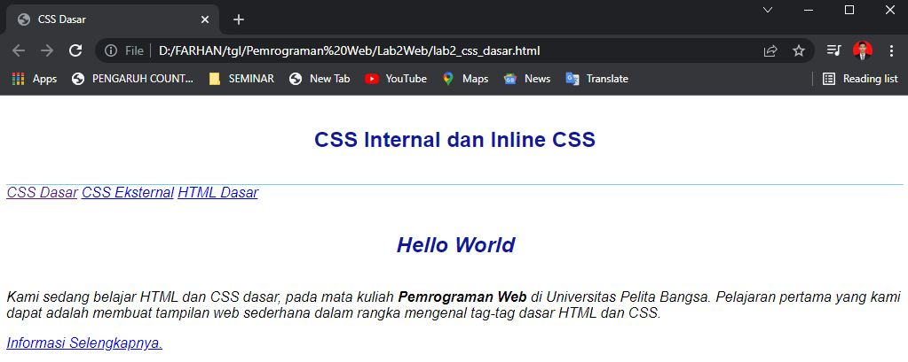
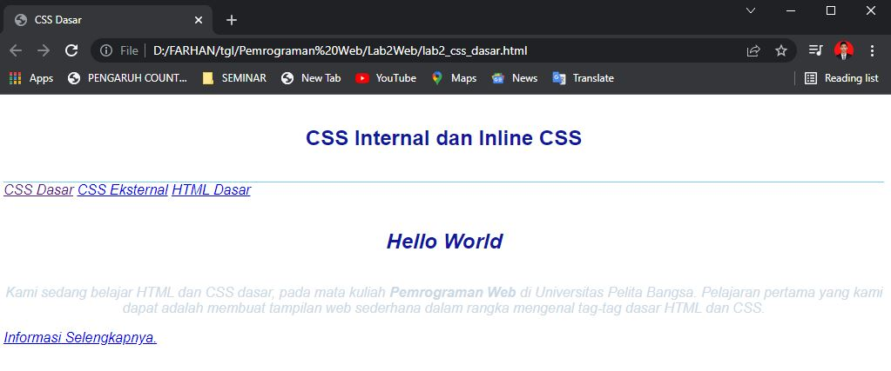
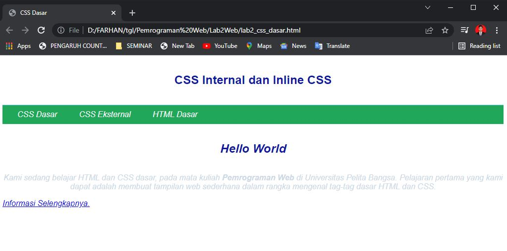
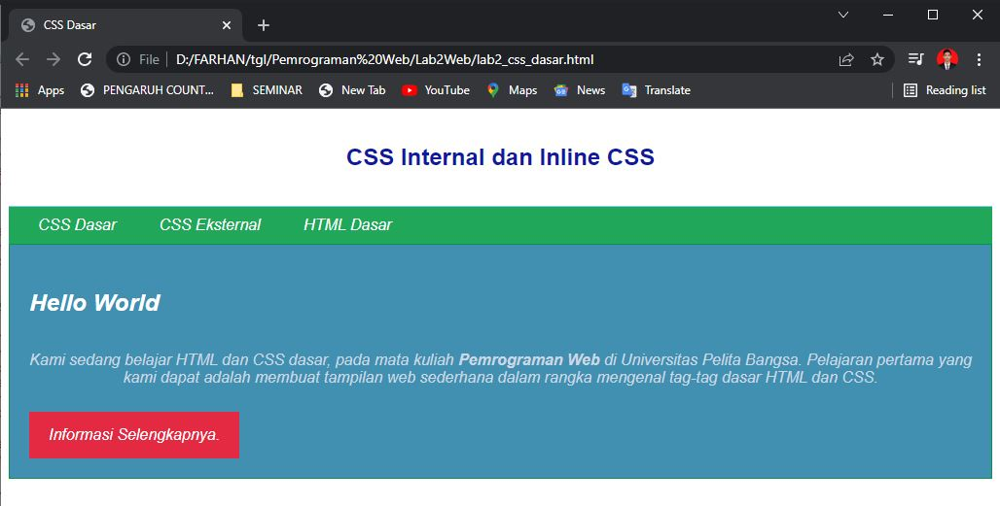

# Lab2Web
<b>_Tugas Praktikum 2_</b>

Nama    : Muhammad Farhan Alfarizi
 
NIM     : 312010210
 
Kelas   : TI.20.B1
  

 1.**MEMBUAT DOKUMEN HTML**

 Disini saya akan menampilkan dokumen HTML yang saya buat.
 

2.**MENDEKLARASI CSS INTERNAL**

Pada point yang kedua saya akan menambahkan deklarasi CSS internal seperti berikut ini

3.**MENAMBAHKAN INLINE CSS**

selanjutnya kita akan menambahkan Inline CSS

4.**Membuat CSS Eksternal**

pada point nomor 4 kita akan membuat css eksternal

5.**MENAMBAHKAN CSS SELECTOR**

Beginilah tampilan akhir setelah kita tambahkan CSS Selector
